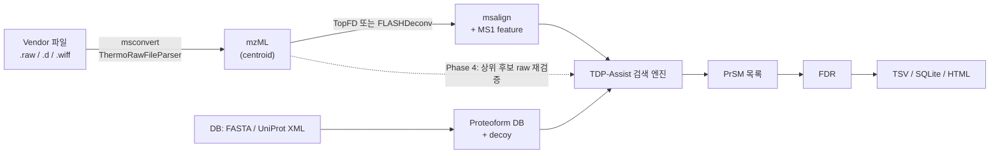
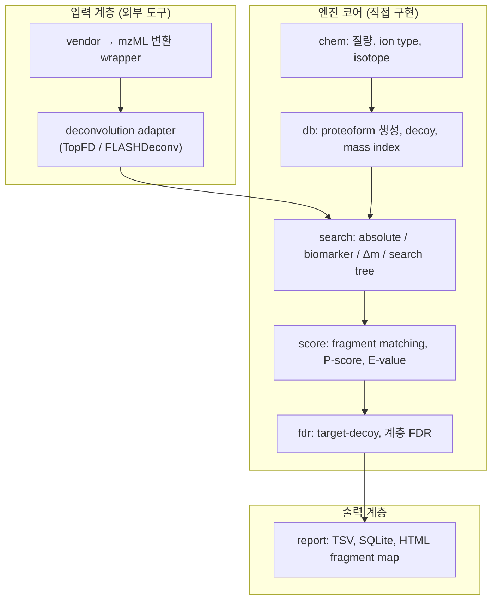
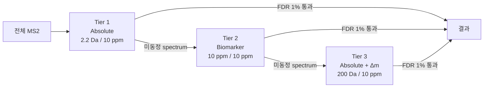

# TDP-Assist 설계 문서 v0.1

> 상태: **Draft (Phase 0)** · 작성일 2026-10-08
> 모든 설계 결정(D-xx)은 `Proposed` 상태다. 사용자가 승인하면 [DECISIONS.md](../DECISIONS.md)에서 `Accepted`로 바꾼다.
> 약어는 [GLOSSARY.md](../GLOSSARY.md)에 모아 두었다.

---

## 0. 표기 규칙

- **R-xx**는 사용자의 요구다. 요구는 사용자 소유이며, 이 문서는 요구를 재정의하지 않는다.
- **[+제안]** 표시는 사용자가 요구하지 않았지만 설계자가 추가한 내용이다. 채택 여부는 사용자가 정한다.
- **D-xx**는 해법 수준의 설계 결정이다. 근거와 상태는 DECISIONS.md에서 관리한다.
- **요구 해석.** "ProSight PC처럼"을 ProSight의 *검색 개념*을 재현하는 것으로 해석했다. 여기서 검색 개념은 annotated proteoform database, Absolute mass / Biomarker 모드, search tree, P-score/E-value를 말한다. ProSight UI의 외형 복제와 PUF/PWF 파일 포맷 호환은 요구 범위 밖으로 해석했다.

---

## 1. 요구사항

| ID | 요구 (사용자 원문 기반) |
|---|---|
| R-01 | Top-down proteomics용 database search 프로그램을 만든다. 동기는 ProSight PC를 대체하는 것이다. |
| R-02 | Thermo `.raw`, Agilent, Bruker, SCIEX 질량분석 파일을 읽을 수 있어야 한다. |
| R-03 | Deconvolution을 먼저 할지, mzML로 변환한 뒤 서치할지 검토가 필요하다. |
| R-04 | ProSight의 Absolute mass search 모드로 서치가 돌아가야 한다. |
| R-05 | ProSight의 Biomarker search 모드로 서치가 돌아가야 한다. |
| R-06 | 기존 방식보다 나은 개량법을 검토하고 발전시킨다. |
| R-07 | 한 번에 많이 바꾸지 않고 단계적으로 진행한다. |

---

## 2. ProSight가 실제로 한 일: 재현 대상의 정의

### 2.1 파이프라인

ProSightPC에서는 cRAWler가 Thermo RAW를 읽고, Xtract(THRASH 계열 알고리즘)로 deconvolution해서 PUF(ProSight Upload Format) 파일을 만든다.
검색 대상은 UniProt annotation을 조합해 만든 proteoform database(Proteome Warehouse, "shotgun annotation")다.
매치마다 P-score와 E-value를 매기고, 여러 검색을 search tree로 연결한다.

여기서 중요한 사실이 하나 있다. **ProSight는 raw spectrum을 직접 서치하지 않았다.**
ProSight는 deconvolution으로 얻은 neutral monoisotopic mass 목록을 서치했다. 이 사실이 R-03에 대한 답의 출발점이다(§3).

### 2.2 검색 모드

| 모드 | 후보 공간 | 전형적 설정 | 약점 |
|---|---|---|---|
| **Absolute mass** (ProSightPD 명칭: Annotated Proteoform Search) | DB에 명시된 proteoform만 후보가 된다. | Precursor 2.2 Da, fragment 10 ppm. 2.2 Da는 deconvolution의 off-by-one isotope 오류를 흡수하기 위한 값이다. | Annotation에 없는 truncation이나 PTM이 있으면 놓친다. |
| **Absolute mass + Δm mode** | 위와 같은 후보에 대해, 설명되지 않는 질량차 하나의 위치를 fragment로 추정한다. | Precursor 100–1000 Da(예: 200 Da), fragment 10 ppm. | 질량차가 무엇인지 해석하는 일은 사후 작업으로 남는다. |
| **Biomarker** (ProSightPD 명칭: Subsequence Search) | DB 서열의 모든 연속 subsequence가 후보가 된다. | Precursor 10 ppm(25 ppm 이하 권장), fragment 10 ppm. | 계산량이 크다. 문서에는 20 ppm을 넘기면 수일이 걸릴 수 있다는 경고가 있다. |

Northwestern NRTDP의 SOP는 세 모드를 **2.2 Da Absolute → 10 ppm Biomarker → 200 Da Absolute + Δm** 순서의 3단 search tree로 묶어 사용했다.
사용자가 익숙한 워크플로도 이 형태일 가능성이 높다. 그래서 이 3단 구성을 기본 preset으로 재현하는 것을 1차 목표로 둔다.

### 2.3 점수 체계

- **P-score**는 관측 fragment 목록과 서열의 매치가 우연히 그 정도로 좋을 확률이다. Poisson 모델이며, 입력은 매치된 fragment 수, 관측 fragment 총수, fragment 하나가 우연히 매치될 확률이다.
- **E-value**는 P-score에 후보 수를 곱한 값(Bonferroni 보정)이다. 같은 매치라도 후보 공간이 큰 Biomarker 모드에서는 E-value가 더 커진다.
- 우연 매치 확률을 tolerance와 질량 범위로부터 정확히 어떻게 계산하는지는 이번 조사에서 원문 수식을 확보하지 못했다. 이 부분은 **확실하지 않으며**, §5.6의 방법으로 사용자의 기존 ProSight 결과와 대조해서 맞춘다.

### 2.4 현재 시장 상태

ProSightPC의 Thermo 지원 페이지는 Windows 7 기준 요구사항을 적고 있어 오래된 제품으로 보인다.
후속 제품인 ProSightPD는 Proteome Discoverer 노드 형태이며, Proteinaceous가 개발하고 Thermo가 독점 라이선스를 갖고 있다. 이 제품은 Thermo 카탈로그에 4.5 버전으로 올라 있다(2026-10 검색 기준, 판매·지원 상태는 확실하지 않음).
따라서 "ProSight 계열이 사라졌다"는 전제는 정확하지 않을 수 있다. 다만 ProSightPD는 상용이고 Proteome Discoverer에 종속되므로, 직접 소유하고 개량할 수 있는 도구가 필요하다는 R-01의 동기는 그대로 유효하다.

### 2.5 계승할 것과 바꿀 것

| 항목 | ProSight 방식 | TDP-Assist 방침 |
|---|---|---|
| 검색 대상 | Deconvolution된 mass 목록을 서치한다. | 계승한다. Phase 4에서 raw spectrum 재검증을 추가한다 [+제안]. |
| Database | UniProt annotation의 조합을 확장한다. | 계승하되, 확장 방식을 composition-first로 바꾼다 [+제안]. |
| 검색 모드 | Absolute / Δm / Biomarker가 별개 모드다. | 계승하되, 하나의 proteoform 가설 모델의 preset으로 재구성한다 [+제안]. |
| 판정 기준 | P-score와 E-value cutoff를 쓴다. | 호환 점수로 계승하고, target-decoy FDR을 필수로 추가한다 [+제안]. |
| Deconvolution | Xtract(상용, 비공개)를 쓴다. | 쓸 수 없으므로 공개 엔진(TopFD, FLASHDeconv)으로 대체한다. |
| 입력 | Thermo RAW만 받는다. | 4개 vendor로 넓힌다(R-02). |

---

## 3. R-03 검토: Deconvolution이 먼저인가, mzML이 먼저인가

### 3.1 결론

두 선택지는 대안 관계가 아니라 **직렬 단계**다.
mzML 변환은 "파일을 어떻게 읽는가"의 문제이고, deconvolution은 "무엇을 서치하는가"의 문제다. mzML로 바꿔도 deconvolution은 여전히 필요하다.
권장 순서는 **Vendor 파일 → mzML → deconvolution → search**이다(D-001, D-002).

### 3.2 1차 검색에서 deconvolution을 건너뛸 수 없는 이유

Intact protein은 여러 charge state로 나타나고, 각 charge state는 다시 isotope envelope으로 퍼진다.
Raw m/z를 직접 서치하려면 후보마다 모든 fragment × charge × isotope peak을 생성해서 대조해야 한다.

아래는 자릿수 수준의 추정이다.

- Biomarker 모드의 후보는 precursor 하나당 약 10^4개다(§5.4 계산).
- 후보 하나의 theoretical fragment는 약 400개다(b/y, 서열 길이 약 200 기준).
- Deconvoluted mass로 대조하면 10^4 × 400 = 4×10^6 연산이 spectrum 하나에 든다.
- Raw로 대조하면 fragment마다 charge 약 10개 × isotope peak 약 10개를 봐야 하므로 100배가 늘어 4×10^8 연산이 든다. MS2 5,000개면 2×10^12 연산이다.

따라서 1차 후보 검색은 deconvoluted mass로 한다. Raw spectrum 대조는 상위 소수 후보를 재검증하는 데만 쓰는 것이 합리적이다 [+제안, Phase 4].
이 재검증 단계는 isotope envelope을 raw peak에 직접 맞추는 Informed-Proteomics(MSPathFinder) 계열 접근을 참고할 만하다(세부 구현은 확인 필요).

### 3.3 Vendor 파일을 직접 읽지 않고 mzML을 거치는 이유

1. 유지보수할 reader가 vendor SDK 4종에서 mzML reader 1종으로 줄어든다.
2. Agilent와 SCIEX의 vendor library는 Windows runtime을 요구한다. ProteoWizard msconvert는 Windows에서 네이티브로 돌고, Linux/macOS에서는 Docker + Wine 이미지로 돈다.
3. Thermo RAW는 ThermoRawFileParser로 Linux/macOS에서도 변환할 수 있다.
4. 공개 deconvolution 엔진(TopFD, FLASHDeconv)이 모두 mzML을 입력으로 받는다.
5. mzML은 HUPO-PSI 표준이므로 논문 데이터 공유와 재현성에 유리하다.

비용도 있다. 변환 시간과 디스크가 추가로 들고, 일부 vendor 고유 메타데이터(예: Thermo trailer 정보)는 빠질 수 있다.
반면 1차 검색에 필요한 정보, 즉 activation type, isolation window, retention time, precursor 정보는 mzML에 남는다.

**변환 설정 권장안.** MS1과 MS2를 모두 vendor peak picking으로 centroid한다. TopFD와 FLASHDeconv가 centroid 입력을 기대하기 때문이다.
Phase 4의 raw 재검증을 위해 profile 변환본은 선택적으로 보관한다.

### 3.4 권장 파이프라인



### 3.5 저분해능 데이터 주의

Q-TOF(Agilent, SCIEX, Bruker)로 큰 단백질을 측정하면 precursor의 isotope peak이 분리되지 않을 수 있다. 이 경우 monoisotopic mass를 구할 수 없으므로 average mass를 써야 한다.
그래서 데이터 모델은 처음부터 precursor mass type(`monoisotopic` / `average`) 필드를 둔다.
Isotope가 분리되지 않은 precursor용 deconvolution(charge-state deconvolution, 예: UniDec)은 Phase 4 이후로 미룬다.

### 3.6 Deconvolution 엔진 선택 (D-002)

- 내부 계약은 **msalign 포맷**으로 정한다. TopFD와 FLASHDeconv가 모두 msalign을 출력하므로 엔진 두 개를 adapter 하나로 받을 수 있다.
- 기본 엔진은 **TopFD**로 시작한다. 같은 msalign을 TopPIC에도 넣을 수 있어서, 검색 엔진의 차이를 deconvolution의 차이와 분리해 검증할 수 있기 때문이다.
- FLASHDeconv는 두 번째 adapter로 붙인다. 최종 기본값은 Phase 1에서 사용자 데이터로 두 엔진을 비교한 뒤 정한다.
- **검색 성능의 천장은 deconvolution 품질이 정한다.** Precursor deconvolution 오류는 proteoform 수준 target-decoy FDR까지 왜곡한다는 보고가 있다(Jeong et al. 2023). 그래서 Phase 1부터 deconvolution 엔진 효과를 따로 측정한다.

---

## 4. 아키텍처

### 4.1 계층 구조



이 구조의 핵심 원칙은 **외부 도구가 바뀌어도 엔진 코어는 바뀌지 않는다**는 것이다.
엔진 코어는 msalign 수준의 데이터 모델만 알고, vendor나 deconvolution 엔진의 존재를 모른다.

### 4.2 패키지 구조

```
src/tdp_assist/
  chem/      원소·잔기·화학식 질량, fragment ion type, isotope 모델
  io/        msalign reader, mzML 메타데이터 reader, vendor 변환 wrapper
  deconv/    외부 deconvolution 엔진 adapter
  db/        FASTA / UniProt XML parser, proteoform 생성, decoy, mass index
  search/    후보 생성(absolute, biomarker, delta_m), search tree
  score/     fragment matching, P-score / E-value, (Phase 4) rescoring
  fdr/       target-decoy competition, 계층 FDR
  report/    TSV, SQLite, HTML fragment map
  cli.py
tests/
docs/
```

### 4.3 기술 스택 (D-003)

- 언어는 **Python 3.11+**, 수치 계산은 **numpy**, 반복 루프 hot path는 **numba**로 컴파일한다.
- 파일 파싱은 pyteomics(mzML, FASTA)와 lxml(UniProt XML)을 쓴다. 결과 저장소는 SQLite, 테스트는 pytest, 설정 파일은 TOML이다.
- **Python을 고른 이유.** 사용자가 코드를 직접 읽고 고칠 수 있어야 단계적 진행(R-07)이 성립한다. §5.4의 계산량 추정상 numba로 충분히 실용 속도가 나온다.
- **되돌림 비용을 낮추는 장치.** 계산 kernel(후보 열거, fragment matching)은 순수 함수 인터페이스 뒤에 둔다. 측정상 병목이 확인되면 그 kernel만 Rust(PyO3)로 교체한다.

### 4.4 핵심 데이터 모델

```python
@dataclass
class PrecursorCandidate:          # MS2 하나에 여러 개가 붙을 수 있다 (chimeric 대비)
    mass: float                    # neutral mass
    mass_type: Literal["mono", "average"]
    charge: int | None
    intensity: float | None
    feature_id: int | None         # MS1 feature (LC 방향으로 묶인 proteoform 신호)

@dataclass
class DeconvolutedMs2:
    scan: int
    rt_min: float
    activation: str                # HCD, CID, ETD, ECD, EThcD, UVPD, EAD ...
    isolation_window: tuple[float, float] | None
    precursors: list[PrecursorCandidate]
    frag_mass: np.ndarray          # neutral monoisotopic mass, 오름차순
    frag_intensity: np.ndarray
    frag_charge: np.ndarray

@dataclass
class ProteoformCandidate:
    accession: str
    start: int; end: int           # 0-based, end exclusive
    nterm: str                     # none / acetyl / ...
    mod_composition: dict[str, int]   # composition-first: 위치 없이 종류별 개수만 둔다
    mass: float
    proforma: str                  # ProForma 2.0 표기
    is_decoy: bool

@dataclass
class PrSM:                        # Proteoform-Spectrum Match
    scan: int
    precursor: PrecursorCandidate
    proteoform: ProteoformCandidate
    tier: str                      # search tree 단계
    delta_mass: float              # 관측 - 이론
    isotope_error: int
    n_matched: int; n_observed: int
    p_score: float; e_value: float
    q_value: float | None
    localization: list[int] | None    # Δm 또는 PTM의 가능 위치 구간
```

Proteoform 표기는 **ProForma 2.0**(HUPO-PSI 표준 표기법)으로 통일한다. 이렇게 하면 결과를 다른 도구나 Proteoform Atlas와 바로 주고받을 수 있다.

---

## 5. 검색 엔진 설계

### 5.1 질량 규약

모든 비교는 deconvolution 이후의 **neutral monoisotopic mass 공간**에서 한다.
`S`는 fragment에 포함된 residue mass의 합이다. 아래 offset은 이론 계산값이며, Phase 1에서 단위 테스트로 고정하고 TopPIC/ProSight Lite 출력과 교차 확인한다.

| Ion | Neutral mass | Offset (Da) | 주 사용 activation |
|---|---|---|---|
| a | S − CO | −27.994915 | UVPD |
| a• (a+1) | S − CO + H | −26.987090 | UVPD |
| b | S | 0 | CID, HCD, EThcD, UVPD |
| c | S + NH₃ | +17.026549 | ETD, ECD, EAD, EThcD, UVPD |
| x | S + H₂O + CO − 2H | +43.989829 | UVPD |
| y | S + H₂O | +18.010565 | CID, HCD, EThcD, UVPD |
| y−1 | S + H₂O − H | +17.002740 | UVPD |
| z• | S + H₂O − NH₂ | +1.991841 | ETD, ECD, EAD, EThcD, UVPD |
| z+1 | S + H₂O − NH₂ + H | +2.999666 | ETD, ECD (옵션) |

Activation 정보는 mzML/msalign에서 읽어서 ion type 세트를 자동으로 고른다. 사용자는 이 세트를 덮어쓸 수 있다.

### 5.2 Fragment matching

- 관측 mass 배열과 이론 mass 배열을 모두 정렬한 뒤 two-pointer merge로 대조한다. 비용은 O(N_obs + N_theo)이다.
- Tolerance는 ppm 단위로 지정한다(기본 10 ppm).
- 관측 peak 하나는 최대 한 번만 count한다. 여러 ion type에 동시에 걸리면 첫 매치 하나만 인정하고 나머지는 annotation으로만 남긴다. P-score가 부풀려지지 않게 하기 위해서다.
- **[+제안]** Fragment에도 ±1 isotope 오류를 허용하는 옵션을 둔다. 이 매치는 별도 플래그로 표시하고, 기본 P-score 계산에서는 제외한다.

### 5.3 Absolute mass 모드 (R-04)

**ProSight 호환 preset.** Precursor window 2.2 Da, fragment 10 ppm으로 둔다. 2.2 Da가 ±2.2 Da인지 전체 폭 2.2 Da인지는 확실하지 않으므로 사용자 결과와 대조해서 확정한다.

**[+제안] Isotope-offset 모드.** Window를 넓게 여는 대신, 이론 질량에 isotope offset k·Δ_iso(k ∈ {−2, …, +2})를 더한 다섯 지점 각각에 ppm tolerance를 적용한다.

- 랜덤 후보 수는 window 폭에 비례한다. ±2.2 Da로 해석하면 전체 폭은 4.4 Da다.
- 20 kDa, ±10 ppm이면 지점 하나의 폭은 0.4 Da이고, 다섯 지점의 합은 2.0 Da다. 랜덤 후보가 4.4 / 2.0 = 2.2배 줄어든다.
- 10 kDa면 지점 하나의 폭은 0.2 Da이고 합은 1.0 Da다. 랜덤 후보가 4.4배 줄어든다.
- 부수 효과로 isotope 오류 k가 결과에 명시적으로 남는다. 이 값은 deconvolution 품질 진단에 쓸 수 있다.
- Δ_iso의 기본값은 1.00235 Da(averagine 기준으로 흔히 쓰이는 값, 출처 대조 필요)로 두고 설정으로 바꿀 수 있게 한다. ¹³C−¹²C 값(1.003355 Da)을 쓰더라도 k=2에서 차이는 2 × 0.001005 = 0.0020 Da이다. 20 kDa에서 10 ppm은 ±0.2 Da이므로 이 차이는 결과에 실질적 영향이 없다.

**Δm mode.** Precursor window를 넓게(예: 200 Da) 열고, Δ = M_obs − M_theo를 미지의 수식 하나로 본다. 그 위치는 fragment로 추정한다.

길이 L인 후보에서 cleavage index를 i ∈ {1, …, L−1}, 수식 위치를 s ∈ {0, …, L−1}라 하자.
Prefix fragment i(잔기 0…i−1)는 s < i일 때 Δ를 포함하고, suffix fragment i(잔기 i…L−1)는 s ≥ i일 때 Δ를 포함한다.

$$
\text{Score}(s) = \sum_{i \le s}\big(a_i + b'_i\big) + \sum_{i > s}\big(a'_i + b_i\big)
$$

여기서 $a_i$, $a'_i$는 prefix ion i가 각각 shift 없이, Δ만큼 shift된 상태로 매치되었는지(0/1)를 나타낸다. $b_i$, $b'_i$는 suffix ion에 대해 같은 의미다.
Prefix sum을 쓰면 모든 s에 대한 점수를 O(L)에 계산할 수 있다. 최고 점수를 내는 s들의 구간을 localization 결과로 보고한다. Δ ≈ 0이면 이 식은 일반 Absolute 점수와 같아진다.

### 5.4 Biomarker 모드 (R-05)

**정의.** DB 서열의 모든 연속 subsequence [i, j)를 후보로 삼는다. Precursor tolerance는 좁게(기본 10 ppm) 둔다.

**열거 알고리즘.**

```
precursor mass를 폭 w(최대 tolerance)의 grid bucket에 넣는다
for protein in (target + decoy):
    P = prefix residue mass  (P[0] = 0)
    for i in 0..L-1:
        for j in i+1..L:
            m = P[j] - P[i] + H2O (+ 말단 수식)
            if m > M_max: break
            for k in isotope_offsets:            # [+제안]
                bucket[(m + k·Δ_iso) / w] 와 이웃 bucket의 precursor를 확인한다
                ppm 조건을 만족하면 (precursor, protein, i, j, k)를 후보로 낸다
```

- N 말단 처리: i가 단백질 N 말단(또는 initiator Met 제거 위치)일 때만 acetylation 등 말단 수식 변형을 함께 열거한다 [+제안].
- ProSight의 Biomarker는 annotated DB 엔트리의 subsequence를 대상으로 했다고 기술되어 있다. 하지만 PTM 조합까지 포함했는지는 확실하지 않다. Phase 2는 fixed modification만 지원하고, PTM과 truncation의 결합은 §5.5의 Hybrid 모드로 넘긴다.

**계산량 추정 (사람 Swiss-Prot 기준, 자릿수 수준).**

- 사람 Swiss-Prot은 약 2.04×10^4 엔트리, 평균 길이 약 560, 총 잔기 수 약 1.14×10^7이다(근사값).
- M_max = 50 kDa이면 subsequence 최대 길이는 약 455 잔기다(평균 잔기 질량 약 110 Da 가정).
- 길이 560인 단백질에서 시작점당 평균 끝점 수는 (105×455 + 455×456/2) / 560 = (47,775 + 103,740) / 560 ≈ 271이다.
- 따라서 질량 계산은 1.14×10^7 × 271 ≈ 3.1×10^9회이고, decoy를 포함하면 약 6×10^9회다. 각 연산이 덧셈 한 번과 bucket 조회 한 번이므로 numba로 수십 초 수준이 예상된다(미검증 추정).

**우연 후보 수 추정.** 10 kDa에서 10 ppm은 ±0.1 Da이므로 window 폭은 0.2 Da다.

- 시작점 하나가 이 window에 걸리는 확률은 약 0.2 / 110 ≈ 1.8×10^-3이다.
- 10 kDa에 닿을 만큼 서열이 남은 시작점은 약 9.5×10^6개다(1.14×10^7 − 91 × 2.04×10^4 ≈ 9.5×10^6).
- 따라서 precursor 하나당 후보는 9.5×10^6 × 1.8×10^-3 ≈ 1.7×10^4개이고, decoy를 포함하면 그 두 배다.
- 후보 하나의 fragment matching이 약 400 연산이면 target 기준으로 spectrum당 1.7×10^4 × 400 ≈ 6.8×10^6 연산이고, MS2 5,000개면 약 3.4×10^10 연산이다. Decoy를 포함하면 두 배다. Numba 기준으로 수 분 이내가 예상된다(미검증 추정).
- 이 숫자는 Biomarker의 E-value가 왜 불리한지도 설명한다. Phase 1의 FASTA 규칙 DB(약 2.04×10^4 × 4 ≈ 8×10^4 엔트리)라면 2.2 Da window의 후보는 수 개 수준이다. Annotated DB가 10^6 엔트리로 커져도 후보는 수십~백 개 수준이다. Biomarker의 후보 공간은 이보다 수백~수천 배 크므로, 같은 E-value를 얻으려면 fragment 증거가 더 많이 필요하다.

**비교 기준.** Informed-Proteomics 논문의 정정문은 ProSightPC 3.0 Biomarker 모드가 해당 데이터셋에서 약 480 CPU hours로 예상되어 실행하지 못했다고 적었다. 데이터셋과 하드웨어가 다르므로 이 숫자를 직접 비교하지는 않는다. 다만 Biomarker의 병목이 모드 개념이 아니라 구현에 있었다는 근거로는 충분하다.

**[+제안] Biomarker + isotope offset.** 10 ppm window에서는 monoisotopic 오류 1 Da만으로도 정답 후보가 통째로 빠진다. 그래서 isotope offset {−1, 0, +1}을 기본으로 켠다. 비용은 후보 수 약 3배다.

### 5.5 [+제안] 통합 proteoform 가설 모델과 Hybrid 모드

네 가지 검색 모드는 하나의 가설 공간을 서로 다르게 제한한 것으로 볼 수 있다.

| 모드 | 서열 범위 [start, end) | Annotated PTM | 미지 질량차 Δ |
|---|---|---|---|
| Absolute | Annotation이 정한 범위만 허용한다. | Annotation 조합을 허용한다. | 0 |
| Absolute + Δm | Annotation이 정한 범위만 허용한다. | Annotation 조합을 허용한다. | 1개, 넓은 window |
| Biomarker | 모든 연속 구간을 허용한다. | Fixed mod만 허용한다. | 0 |
| **Hybrid [+제안]** | 모든 연속 구간을 허용한다. | Annotation 조합 k개 이하를 허용한다. | 0 또는 1개 |

엔진을 이 모델 하나로 구현하면 모드 추가가 설정 변경으로 끝난다. 생물학적으로 흔한 "절단 + 수식" proteoform(예: signal peptide 절단 후 phosphorylation)은 현재 어느 모드도 정면으로 잡지 못하는데, Hybrid가 이 공백을 메운다.
Hybrid는 후보 공간이 크기 때문에 fragment 기반 사전 필터(sequence tag 또는 fragment mass index)가 필요하다. 따라서 Phase 3 이후에 둔다.

### 5.6 점수 (P-score, E-value)

ProSight 계열의 Poisson 모델을 기본 골격으로 구현한다.

$$
\lambda = N_{\text{obs}} \cdot p,\qquad
P = \Pr[X \ge n] = 1 - \sum_{i=0}^{n-1} \frac{\lambda^{i} e^{-\lambda}}{i!},\qquad
E = P \cdot N_{\text{cand}}
$$

- n은 매치된 관측 fragment 수, N_obs는 관측 fragment 총수, N_cand는 그 precursor에 대해 평가한 후보 수다.
- p는 관측 fragment 하나가 우연히 매치될 확률이다. 초기 근사로 p ≈ min(1, N_theo · 2δ / R)를 쓴다. δ는 Da 단위 tolerance, R은 관측 fragment 질량 범위다. **이 근사는 가정이다.**
- **보정 방법.** 사용자의 ProSight PC 결과에는 매치 수와 P-score가 함께 나온다. 같은 PrSM에 대해 p를 역산하면 ProSight의 실제 파라미터화를 추정할 수 있다. 이 작업은 Phase 1 검증 항목이다.
- P-score는 intensity, mass error 분포, ion 상보성을 무시한다. 이 한계는 Phase 4의 rescoring으로 보완한다.

### 5.7 [+제안] FDR

E-value cutoff만으로는 실제 오류율을 알 수 없다. 그래서 target-decoy를 Phase 2부터 필수로 넣는다.

- **Decoy 생성.** Annotation 구간별로 잔기를 섞되, 수식이 붙은 잔기와 N 말단 Met은 제자리에 고정한다. 구간별 조성이 보존되므로 모든 annotated proteoform의 intact mass가 target과 정확히 같다. 따라서 Absolute 모드에서 decoy가 같은 precursor를 두고 공정하게 경쟁한다. Seed를 고정해서 재현성을 보장한다.
- **경쟁 방식.** Spectrum마다 최고 target과 최고 decoy가 경쟁한다(target-decoy competition). q-value는 (decoy 수 + 1) / target 수로 계산한다.
- **계층.** PrSM → proteoform(고유 ProForma) → protein 순서로 FDR을 따로 계산한다. Search tree의 tier마다도 따로 계산한다. LeDuc et al. 2019는 search context를 무시하면 FDR이 20배 넘게 틀릴 수 있음을 보였다.
- **Phase 4 보완.** Precursor deconvolution 오류는 proteoform 수준 FDR을 과소추정하게 만든다(Jeong et al. 2023). Deconvolution 오류율을 반영한 보정을 추가한다.

### 5.8 Search tree



- 기본 preset은 ProSight 3단 구성이다. Tier 구성과 파라미터는 TOML로 바꿀 수 있다.
- 각 tier는 자기 decoy로 FDR을 계산한다. 앞 tier에서 이미 동정된 spectrum을 빼고 다음 tier로 넘기면 tier마다 null 분포가 달라지기 때문이다.

---

## 6. Database 설계

### 6.1 입력

| 입력 | 내용 | 도입 시점 |
|---|---|---|
| FASTA | 서열만 있다. 규칙 기반으로 단순 proteoform을 만든다. | Phase 1 |
| UniProt XML | Feature annotation을 포함한다. ProSight식 annotated DB를 만든다. | Phase 3 |
| PEFF | HUPO-PSI의 annotation 포함 FASTA 확장 포맷이다. 사용자 정의 DB용이다. | Phase 3 이후 |

**Phase 1 FASTA 규칙 [+제안].** 단백질마다 {원형, initiator Met 제거} × {N-acetyl 없음, N-acetyl 있음}을 만든다.
Met 제거는 두 번째 잔기가 작은 잔기(A, C, G, P, S, T, V)일 때만 적용한다. 이것은 MetAP 기질 특이성에 기반한 근사이며, annotation이 없을 때의 대체 규칙이다.

**Phase 3 UniProt feature 활용.** initiator methionine, signal peptide, transit peptide, propeptide, chain, peptide, modified residue, lipidation, disulfide bond, sequence variant, isoform을 사용한다.

### 6.2 [+제안] Composition-first 확장

Intact mass는 수식의 *위치*가 아니라 *조성*에만 의존한다. 따라서 DB에는 조성 단위로 엔트리를 만들고, 위치는 검색 후 fragment로 추정한다.

- 예를 들어 annotated phospho site가 10개이고 최대 3개까지 허용한다고 하자.
- 위치별로 열거하면 C(10,0) + C(10,1) + C(10,2) + C(10,3) = 1 + 10 + 45 + 120 = 176개 엔트리가 생긴다.
- 조성 단위로 만들면 phospho 0, 1, 2, 3개의 4개 엔트리면 된다. 위치는 §5.3과 같은 DP로 정한다.
- **열린 문제.** 조성 하나 안에서 위치 조합을 최적화하면 그 자체가 다중 비교다. E-value의 N_cand를 조성 수로 셀지, 위치 조합 수로 셀지는 decoy 실험으로 정한다(Question 로그 Q-03).

### 6.3 저장

Proteoform 엔트리는 질량순으로 정렬한 numpy 배열(memory-mapped)과 메타데이터 SQLite로 저장한다. Decoy는 같은 저장소에 플래그로 구분해서 넣는다.

---

## 7. 출력

- **TSV**: PrSM, proteoform, protein 세 수준으로 나눠서 출력한다. Excel에서 바로 열 수 있다.
- **SQLite 결과 저장소**: ProSight의 repository에 해당한다. 여러 run과 tier의 결과를 한 파일로 질의할 수 있다.
- **HTML report [+제안]**: 서열 위에 fragment 절단 위치를 깃발로 표시하는 ProSight Lite 스타일 fragment map을 만든다. GUI가 생기기 전까지 결과를 검토하는 주 도구다.
- **mzIdentML**: 논문 제출용 표준 포맷이다. Phase 5에서 지원한다.

---

## 8. 개량 후보 backlog (R-06 대응, 전부 [+제안])

| ID | 개량 내용 | 왜 필요한가 | 비용 | Phase |
|---|---|---|---|---|
| I-01 | Isotope-offset precursor matching | Off-by-one 오류를 넓은 window 대신 명시적으로 흡수해서 랜덤 후보를 2–4배 줄인다. | 낮음 | 1 |
| I-02 | 고속 Biomarker 열거 (grid bucket + numba) | ProSight Biomarker의 실사용 장벽은 계산 시간이었다. | 중간 | 2 |
| I-03 | Target-decoy FDR (tier별, 계층별) | E-value만으로는 오류율을 알 수 없다. Context를 무시하면 FDR이 20배 넘게 틀린다. | 중간 | 2 |
| I-04 | Composition-first DB | 위치 이성질체 폭증을 막고 DB를 작게 유지한다. | 중간 | 3 |
| I-05 | 통합 가설 모델 + Hybrid 모드 | 절단과 수식이 동시에 있는 proteoform을 잡는다. | 높음 | 3 |
| I-06 | 위치 확신도 점수 (C-score 계열) | PTM 위치를 어느 정도 확신할 수 있는지 수치로 제시한다. | 중간 | 3 |
| I-07 | Chimeric precursor 처리 | Top-down isolation window에는 여러 proteoform이 함께 들어오는 일이 흔하다. MS1 feature 여러 개를 precursor 후보로 붙인다. | 중간 | 4 |
| I-08 | 질량 재보정 (recalibration) | 1차 고신뢰 결과로 precursor와 fragment의 ppm 오차를 보정한 뒤 tolerance를 좁혀 재검색한다. | 낮음 | 4 |
| I-09 | ML rescoring (Percolator 계열) | 매치 수 외의 feature(intensity, mass error, 상보 ion, coverage)를 학습해서 판별력을 높인다. | 중간 | 4 |
| I-10 | Deconvolution 오류 반영 FDR | Precursor 오류로 생기는 FDR 과소추정을 보정한다. | 중간 | 4 |
| I-11 | Raw spectrum 재검증 | 상위 후보를 isotope envelope 단위로 raw peak에 다시 맞춰서 deconvolution 오류를 교정한다. | 높음 | 4 |
| I-12 | Activation 자동 인식 확장 (UVPD, EAD) | SCIEX ZenoTOF의 EAD, UVPD 데이터의 ion type을 자동으로 정한다. | 낮음 | 4 |
| I-13 | Run 간 정렬과 정량 | 여러 run에 걸쳐 proteoform을 정렬하고 MS1 feature 기반으로 정량한다. | 높음 | 5 |
| I-14 | Internal fragment | Coverage는 늘지만 우연 매치도 늘어난다. FDR 체계가 선 뒤에만 시도한다. | 중간 | 5+ |

**우선순위 판단.** 가장 큰 효과가 예상되는 세 가지는 I-03(FDR), I-07(chimeric), I-01/I-08(precursor 질량 정확도)이다.
세 가지 모두 "검색 알고리즘"보다 "검색 입력의 정확도와 판정 기준"을 고치는 일이다. Top-down에서 동정 실패의 큰 원인이 precursor 질량 오류라는 판단에 근거한다(§10.2).

---

## 9. 로드맵 (R-07 대응)

각 Phase는 끝날 때 사용자가 결과를 확인하고 다음 Phase를 승인하는 구조로 진행한다.

| Phase | 목표 | 완료 기준 |
|---|---|---|
| 0 | 설계 (이 문서) | 사용자가 D-001 ~ D-008을 승인한다. |
| **1** | **Absolute mass vertical slice** | Thermo RAW 파일 하나의 결과를 ProSight PC 결과와 대조한 보고서가 나온다. |
| 2 | Biomarker, Δm, FDR, 3단 search tree를 구현하고 나머지 3개 vendor 변환 경로를 검증한다. | ProSight 3단 preset이 FDR과 함께 끝까지 돈다. |
| 3 | UniProt XML annotated DB, composition-first, localization, Hybrid 모드를 구현한다. | Annotated DB 결과를 Phase 2 FASTA 결과와 비교한다. |
| 4 | 정확도 개량(I-07 ~ I-12)을 진행한다. | 같은 FDR에서 동정 수 증가를 측정한다. |
| 5 | 결과 viewer(local web GUI), 정량, 다중 run을 구현한다. | 사용자가 GUI만으로 결과를 검토할 수 있다. |
| 6 | 필요할 때만 native vendor reader, 자체 deconvolution, Rust kernel을 만든다. | 측정된 병목이 있을 때만 착수한다. |

### 9.1 Phase 1 상세 (승인 대기)

작업은 리뷰 가능한 크기의 commit 단위로 나눈다.

1. **1-1 골격**: pyproject, src layout, pytest, ruff를 설정한다.
2. **1-2 chem**: 원소·잔기 질량과 fragment offset(§5.1)을 구현하고, 독립 계산값과 대조하는 단위 테스트를 둔다.
3. **1-3 io**: msalign reader를 TopFD와 FLASHDeconv 변형 모두에 대해 구현한다. 여러 precursor가 들어 있는 경우도 처리한다. 실제 파일로 포맷을 확인한 뒤 고정한다.
4. **1-4 db**: FASTA reader와 N 말단 규칙(§6.1)으로 proteoform 목록과 질량 인덱스를 만든다.
5. **1-5 search/score**: Absolute 모드(2.2 Da preset과 isotope-offset 모드), fragment matching, P-score/E-value를 구현한다.
6. **1-6 report/CLI**: TSV를 출력하고 `tdp-assist search --mode absolute ...` 명령을 만든다.
7. **1-7 검증**:
   - (a) 사용자의 ProSight PC 결과와 top hit 일치율을 측정한다.
   - (b) 같은 msalign을 TopPIC(unknown shift 0)에 넣어 결과를 교차 확인한다.
   - (c) 불일치를 원인별(deconvolution 차이 / DB 차이 / 점수 차이)로 분류해서 보고한다.

Phase 1에서 의도적으로 뺀 것은 FDR, Biomarker, Δm, UniProt XML, GUI다. 이것들은 Phase 2 이후에 넣는다.

---

## 10. 반론과 리스크

### 10.1 이 설계의 전제에 대한 가장 강한 반론

**"ProSight를 재현한다"를 목표로 삼으면 2000년대의 설계 제약까지 함께 재현하게 된다.**
그 제약은 E-value만으로 하는 판정, 위치 이성질체의 명시적 열거, MS2당 precursor 하나라는 가정이다.
그래서 ProSight 호환은 Phase 1–2의 *검증 기준*으로만 쓴다. 이후의 판정 기준은 FDR로 옮긴다. 사용자가 익숙한 모드와 점수 표시는 유지하되, 결과의 합격선은 FDR이 정한다.

**"직접 만들 필요가 있는가."** TopPIC은 공개 소프트웨어이고, truncation과 미지 질량차 처리에 강하다. 그래서 엔진을 새로 만드는 대신 TopPIC 위에 UI만 얹는 경로도 실재하는 대안이다.
그래도 직접 만들기를 권하는 이유는 두 가지다.
첫째, TopPIC은 FASTA 기반이며 UniProt feature annotation 기반 proteoform DB를 직접 쓰지 않는 것으로 알고 있다(확인 필요). 둘째, 사용자가 원하는 Absolute/Biomarker 의미론과 P-score 체계를 그대로 재현할 수 없다.
그래서 TopPIC은 엔진이 아니라 **벤치마크 기준**으로 쓴다.

### 10.2 리스크

| 리스크 | 내용 | 대응 |
|---|---|---|
| Deconvolution이 성능 천장을 정한다 | 검색 엔진이 아무리 좋아도 틀린 precursor mass는 복구하지 못한다. | 엔진 두 개를 비교하고, isotope offset과 재보정, Phase 4 raw 재검증으로 대응한다. |
| Vendor 변환 | Agilent와 SCIEX는 Windows 또는 Docker + Wine이 필요하다. 지원 여부는 vendor와 버전에 따라 다르다. | 사용자 실제 파일로 Phase 2에서 검증한다. |
| 라이선스 | ProteoWizard의 vendor-enabled 빌드는 유료 사용이 금지되어 있다. Thermo RawFileReader에도 별도 라이선스가 있다. | 연구용은 문제가 없다. 상용화를 고려하면 변환을 사용자 측 단계로 분리하고, 엔진 코어는 외부 라이선스와 독립시킨다. |
| 저분해능 데이터 | 큰 단백질의 Q-TOF precursor는 isotope가 분리되지 않는다. | Average mass 모드를 둔다(§3.5). |
| 통계 | Composition-first와 다단 tier는 다중 비교 계산을 바꾼다. | Decoy 실험으로 E-value와 FDR의 보정 상태를 확인한다. |
| 범위 팽창 | 개량 아이디어가 많아 Phase 1이 늘어질 수 있다. | Phase마다 완료 기준을 고정하고, backlog는 승인 전까지 착수하지 않는다. |

### 10.3 핵심 결정에 대한 [B] 트랙 검토 (제품·기술·전략)

검토 대상 결정은 "엔진 코어는 직접 구현하고, 변환과 deconvolution은 외부 도구로 처리하며, Python으로 시작한다"이다.

- **사용자**: 사용자는 ProSight식 개념(annotated DB, 모드, E-value)에 익숙하다. 결과 해석 체계가 같아야 전환 비용이 낮으므로 P-score/E-value 호환과 3단 preset을 유지한다.
- **구현 비용**: Vendor reader 4종과 deconvolution을 직접 만들면 엔진 코어보다 몇 배 큰 작업이 된다. 외부 도구를 쓰면 Phase 1–3의 작업은 엔진 코어에 집중된다.
- **경쟁·대체재**: TopPIC(공개, 미지 질량차 처리에 강함), ProSightPD(상용, PD 종속), MSPathFinder, MetaMorpheus, FLASHTnT(OpenMS, 개발 중)가 있다. TDP-Assist의 차별점은 annotated proteoform DB, ProSight 모드 의미론, 현대적 FDR의 결합이다.
- **수익·전략**: 연구 도구로 쓰는 범위에서는 제약이 없다. 상용화를 고려하면 §10.2의 라이선스 조건이 걸리므로 엔진 코어를 외부 라이선스로부터 분리해 둔다.
- **통합 권고**: 엔진 코어는 직접 만든다. 파일 변환과 deconvolution은 adapter로 외부 도구를 쓴다. TopPIC은 벤치마크 기준으로 쓴다. 이 구조는 Phase 6에서 외부 도구를 자체 구현으로 바꾸더라도 엔진 코어를 건드리지 않는다.

---

## 11. 사용자에게 필요한 자료 (Pending)

Phase 1 검증에는 아래 자료가 필요하다. 이것은 결정 사항이 아니라 준비물이다.

1. 예전에 ProSight PC로 분석했던 **Thermo RAW 파일 1개**가 필요하다.
2. 그 RAW 파일에 대한 **ProSight PC 결과 export**(hit 목록, P-score, E-value, 매치 fragment 수)가 필요하다.
3. 가능하면 **PUF 파일**도 필요하다. PUF에는 Xtract가 만든 deconvoluted mass가 들어 있으므로, 같은 mass 입력으로 검색 엔진만 비교할 수 있다. PUF의 내부 포맷은 확실하지 않으므로 파일을 받아서 확인한다.
4. 당시 사용한 **database**(또는 종 정보와 UniProt 버전)와 **search tree 설정**이 필요하다.
5. 사용하는 **기기와 activation 방식**(예: Orbitrap Eclipse, HCD/ETD)을 알려주면 된다.

---

## 12. 참고문헌

- Meng F, et al. Informatics and multiplexing of intact protein identification in bacteria and the archaea. *Nat Biotechnol.* 2001;19(10):952–957.
- Taylor GK, et al. Web and database software for identification of intact proteins using "top down" mass spectrometry. *Anal Chem.* 2003;75(16):4081–4086.
- Pesavento JJ, Kim YB, Taylor GK, Kelleher NL. Shotgun annotation of histone modifications. *J Am Chem Soc.* 2004;126(11):3386–3387.
- Zamdborg L, et al. ProSight PTM 2.0: improved protein identification and characterization for top down mass spectrometry. *Nucleic Acids Res.* 2007;35:W701–W706.
- LeDuc RD, et al. The C-score: a Bayesian framework to sharply improve proteoform scoring in high-throughput top down proteomics. *J Proteome Res.* 2014;13(7):3231–3240.
- LeDuc RD, et al. Accurate Estimation of Context-Dependent False Discovery Rates in Top-Down Proteomics. *Mol Cell Proteomics.* 2019;18(4):796–805. doi:10.1074/mcp.RA118.000993
- Jeong K, Kaulich PT, Jung W, Kim J, Tholey A, Kohlbacher O. Precursor deconvolution error estimation: The missing puzzle piece in false discovery rate in top-down proteomics. *Proteomics.* 2024;24(3–4):2300068 (online 2023). doi:10.1002/pmic.202300068
- Horn DM, Zubarev RA, McLafferty FW. Automated reduction and interpretation of high resolution electrospray mass spectra of large molecules. *J Am Soc Mass Spectrom.* 2000;11(4):320–332. (THRASH)
- Senko MW, Beu SC, McLafferty FW. Determination of monoisotopic masses and ion populations for large biomolecules from resolved isotopic distributions. *J Am Soc Mass Spectrom.* 1995;6(4):229–233. (averagine)
- Kou Q, Xun L, Liu X. TopPIC: a software tool for top-down mass spectrometry-based proteoform identification and characterization. *Bioinformatics.* 2016;32(22):3495–3497.
- Basharat AR, Zang Y, Sun L, Liu X. TopFD: A Proteoform Feature Detection Tool for Top-Down Proteomics. *Anal Chem.* 2023;95(21):8189–8196.
- Jeong K, et al. FLASHDeconv: Ultrafast, High-Quality Feature Deconvolution for Top-Down Proteomics. *Cell Syst.* 2020;10(2):213–218.e6.
- Park J, et al. Informed-Proteomics: open-source software package for top-down proteomics. *Nat Methods.* 2017;14(9):909–914. 및 Author Correction(2021).
- Hulstaert N, et al. ThermoRawFileParser: Modular, Scalable, and Cross-Platform RAW File Conversion. *J Proteome Res.* 2020;19(1):537–542.
- Chambers MC, et al. A cross-platform toolkit for mass spectrometry and proteomics. *Nat Biotechnol.* 2012;30(10):918–920. (ProteoWizard)
- Martens L, et al. mzML—a community standard for mass spectrometry data. *Mol Cell Proteomics.* 2011;10(1):R110.000133.
- LeDuc RD, et al. ProForma 2.0: A Universal Notation for Proteoforms. *J Proteome Res.* 2022;21(4):1189–1195.
- Käll L, et al. Semi-supervised learning for peptide identification from shotgun proteomics datasets. *Nat Methods.* 2007;4(11):923–925. (Percolator)
- Marty MT, et al. Bayesian deconvolution of mass and ion mobility spectra: from binary interactions to polydisperse ensembles. *Anal Chem.* 2015;87(8):4370–4376. (UniDec)

웹 자료 (2026-10-08 확인):

- ProSightPD 4.4 User Guide (Thermo Fisher): https://docs.thermofisher.com/r/ProSightPD-4.4-User-Guide/1345304331v2en-US1665219851
- ProSightPD 카탈로그 (PROSIGHTPD4): https://www.thermofisher.com/order/catalog/product/PROSIGHTPD4
- NRTDP SOP 007 — Minimum Information for Reporting Proteoforms: https://nrtdp.northwestern.edu/wp-content/uploads/2018/12/SOP_007_NU_3_Minimum_Information_for_Reporting_Proteoforms_Final.pdf
- Informed-Proteomics Author Correction (PNNL): https://www.pnnl.gov/publications/author-correction-informed-proteomics-open-source-software-package-top-down-proteomics
- TopPIC suite manual: https://toppic.sciencegateways.iu.edu/toppic-manual/
- FLASHDeconv (OpenMS): https://openms.de/FLASHDeconv
- ProteoWizard Docker 이미지: https://hub.docker.com/r/proteowizard/pwiz-skyline-i-agree-to-the-vendor-licenses
